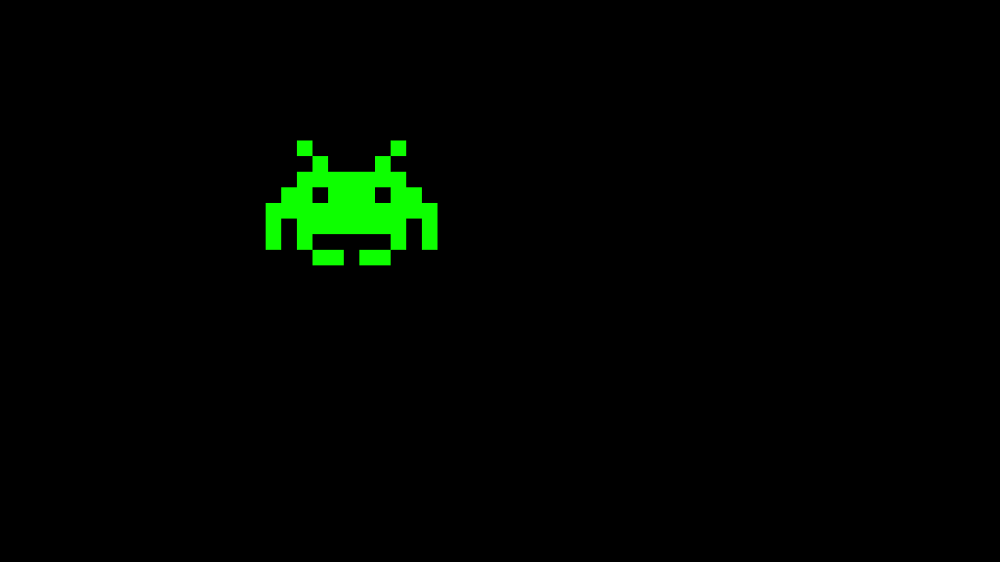

# Invaders Trilogy!

> "They're back for more!"

# Resources to help

Provided below are a list of curated resources to help you complete the task(s) below. Consult them (read them, or do ctrl+f for keywords) if you get stuck.

| D Programming Related Links                         | Description                       |
| --------------------------------------------------  | --------------------------------- |
| [My D Youtube Series](https://www.youtube.com/playlist?list=PLvv0ScY6vfd9Fso-3cB4CGnSlW0E4btJV) | My video series playlist for learning D Lang. |
| [DLang Phobos Standard Library Index](https://dlang.org/phobos/index.html)  | The Phobos Runtime Library (i.e. standard library of code.)
| [D Language Tour](https://tour.dlang.org/)           | Nice introduction to the D Language with samples you can run in the browser. |
| [Programming in D](https://ddili.org/ders/d.en/)     | Freely available D language programming book |
| [My SDL Playlist](https://www.youtube.com/playlist?list=PLvv0ScY6vfd-p1gSnbQhY7vMe2rng0IL0)     | My SDL Playlist |

## Description

[Brenda](https://en.wikipedia.org/wiki/Brenda_Romero) and [John](https://en.wikipedia.org/wiki/John_Romero) Romero are two of the greats in the game industry. Each Brenda and John had their own individual success as game developers and game designers, and then joined forces later in life. Now -- they have discovered you! They see real potential in this Invaders game series that you've been working on, and they might even offer you some venture capital money to publish your game (or at the least -- provide a testimonial in your KickStarter/GoFundMe/IndiGoGo/etc campaign).

Alrighty -- with that excitement, let's figure out the work we need to do to finally get this polished off!

## The Assignment

For this assignment we're going to focus on refining our game and making a few new features. The idea is you'll have a full game and most of your engine in order.

## Recall the previous two assignemnts

### First assignment 

> - There should be some enemies that fire projectiles.
> - There should be a 'hero' that can fire back.
> - There should be some 'projectile' that eliminates the enemies and the player.
> - If the player is hit by a projectile the game ends, or otherwise if all enemies are eliminated the game ends.
> - I expect you can create some basic images (in a program like GNU GIMP, paint, photoshop, etc.) to distinguish between the enemies.
> - You **need** to have a 'GameObject' or 'GameEntity' class.
> - You **need** to implement the 'Component Pattern', such that the 'GameObject' is a holder of between 0..n compoments.
>  	- Components can be either objects themselves or 'handles' to objects. That is your decision.
> - Your game **must** be frame capped to 60 FPS
> - You **must** have a Game Loop and Game Application 
> 	- i.e. I do not want to see you implement the whole game in 'main'
> - You **must** have one level of the game.
> - You need not make your sprites animate, but it may be a good idea to start incorporating your previous assignment into your framework.
> - You *should* use 'factories' for creating Game Objects (i.e. otherwise have some way to quickly 'MakeSprite' without having to build from scratch a game object with individual compoments each time).
> - You can probably get away without using a Vec2 and simply moving around pixels in screenspace.
>   	- However, you *should* consider converting coordinates to world coordinates at the least, and getting use to that system.

### Second assignment 

> - You must create a 'scene tree' in which all of your GameObjects/GameEntities/GameActors are a part of.
>   	- i.e. I should be able to see in your GameApplication some sort of 'Scene' or 'SceneTree' structure.
> - You must implement a ResourceManager such that any resource is loaded through the resource manager.
>   	- There's a little bit of wiggle room here, but ideally references to the same SDL_Texture or SDL_Image should be shared.
>   	- And yes, even if you included all of your sprites into a single sprite sheet, you'll still load that resource through a resource manager.
> - You must incorporate at least 1 sprite animation in your project
>   	- This can be as simple as a two frame animation as displayed below.
>  	- 
> 	- I would encourage you to use a program like the free https://www.gimp.org/ to create a simple sprite sheet.
> - You must incorporate 'rotation' somewhere in your assignment.
>   	- There is some freedom for how you do this, but I should be able to find https://wiki.libsdl.org/SDL2/SDL_RenderCopyEx or https://wiki.libsdl.org/SDL3/SDL_RenderTextureRotated in your code.
>   	- Here are some examples where you might incorporate rotation
>   	  	- The player can rotate and move about freely (Unfair, but perhaps useful :) ) -- Consider then how your bullets can fire at different angles.
>   	  	- The enemies rotate 360 degrees when they are destroyed.
> - You must have a 'score' somewhere as a bitmap font or otherwise using SDL_TTF (Using the bindbc-ttf package is fine for this: https://code.dlang.org/packages/bindbc-sdl/0.21.4 , and you can include any dll/so file if needed)
>   	- Recall our lecture on tiling if you opt for the bitmap font option.

## For **This** assignment

You must incorporate the following features:

- You must add 'sound' to your game using SDL_Audio and/or SDL_Mixer.
- You must implement a 'ScriptComponent' into your game to handle logic.
  	- i.e. A good use case would be to have a 'script component' for your projectile movement.
	- Generally speaking, we want to avoid having special 'game objects' or otherwise deriving many types of game objects (note: The one exception may be for the MainHero, as that may be specialized enough to justify a separate type).
- You should have at least two 'scenes' in your game.
  	- e.g. At the completion of one scene, you should be able to 'load' another scene (perhaps a different number of enemies in different orientations.
  	- e.g. Perhaps your 'second' scene is a main menu, and then another scene is loaded and runs to play your game.
   
## How to compile and run your program

1. You can use simply run `dub` file to build and run the project.
   - Note: `dub test` by default does a debug build.
   - Don't forget to use [gdb](https://www.youtube.com/watch?v=NWsZrN7gXYg) or [lldb](https://www.youtube.com/watch?v=drzvDkU-H54) if you run into errors!

# Submission/Deliverables

### Submission

- Commit all of your files to github, including any additional files you create.
- Do not commit any binary files unless told to do so.
- Do not commit any 'data' files generated when executing a binary.

### Deliverables

- A demo of a space invaders game that meets the above requirements from the previous **two PSETs** and this current PSET.

# Going Further

An optional task(if any) that will reinforce your learning throughout the semester--this is not graded.

1. Add a way to 'save' and 'load' a game that is inprogress.
	- i.e. Serialize and deserialize your 'scene'.

# F.A.Q. (Instructor Anticipated Questions)

0. Q: I'm lost.
   - A: How so? In some cases you might have to throw away your previous Invaders assignment and start from scratch. Learning to throw away code is okay -- you'll probably be able to rebuild faster and with a better design too.
	- A: Something else? Come talk about it at office hours.
